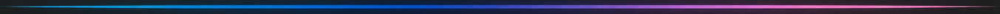

<h1 align="center"> Sistemas Embarcados 2026.2 </h1>

 

<h4 align="center"> Repositório de Atividades - Disciplina de Sistemas Embarcados 2026.2 </h4>
<h4 align="center"> Engenharia de Computação/<a href="https://www.ifpb.edu.br/">IFPB</a> (ago - dez 2026) </h4>

 
 

 

 

<h4> | <a href="#contexto">Contexto</a> | <a href="#atividades">Atividades</a> | <a href="#ferramentas">Ferramentas</a> | <a href="#creditos">Créditos</a> |</h4>

  

<h2 id="contexto"> 🧠 CONTEXTO E OBJETIVO</h2>

Este repositório reúne as atividades, práticas e códigos desenvolvidos durante a disciplina de <b>Sistemas Embarcados</b> do curso de Engenharia de Computação (IFPB). O foco principal abrange a programação do microcontrolador <b>ESP32</b>, simulação de circuitos via <b>Wokwi</b>, manipulação de GPIOs, temporizadores e comunicação com periféricos digitais e analógicos.

  

<h2 id="atividades"> 📑 ATIVIDADES DESENVOLVIDAS</h2>

<b>Atividade 1: Diagramas em Bloco e Esquemático</b>
 
 

* 📄 **Documentação (PDF):** [Relatório da Atividade 1](./atividade_1_diagramas_bloco_esquematico/atvd1_relatorio.pdf)
* ⚙️ **Diagrama em Blocos:** [`Diagrama em Blocos`](./atividade_1_diagramas_bloco_esquematico/atvd1_diagrama_blocos.png)
* 💻 **Diagrama Esquemático** [`Diagrama Esquemático`](./atividade_1_diagramas_bloco_esquematico/atvd1_diagrama_esquematico.png)
    

<b>Atividade 2: Validação do Ambiente de Desenvolvimento (Espressif IDE)</b>

 
Validação de ferramentas realizada em sala de aula.
    

<b>Atividade 3: Saídas digitais (Simulador)</b>

 

* 📄 **Documentação (PDF):** [Relatório da Atividade 3](./atividade_3_saidas_digitais/atvd3_relatorio.pdf)
* 💻 **Código-Fonte:** [`main.c`](./atividade_3_saidas_digitais/main.c)
* ⚙️ **Config simulador** [`diagram.json`](./atividade_3_saidas_digitais/diagram.json)
* 📲 **Download simulador:** [`Circuito`](./atividade_3_saidas_digitais\wokwi-project.txt)
* 📲 **Montagem simulador:** [`Circuito`](./atividade_3_saidas_digitais\atvd3_circuito_wowki.png)
* 📲 **Montagem Circuito:** [`Circuito`](./atividade_3_saidas_digitais\teste.png)
* 🖼️ **Diagrama em Blocos:** [`Diagrama em Blocos`](./atividade_3_saidas_digitais/atvd3_diagrama_blocos.png)
* 🖼️ **Diagrama Esquemático:** [`Diagrama Esquemático`](./atividade_3_saidas_digitais/atvd3_diagrama_esquematico.png)
  

<b>Atividade 4: Entradas digitais (Simulador)</b>
 
 

* 💻 **Código-Fonte:** [`main.c`](./atividade_4_entradas_digitais/main.c)
* ⚙️ **Configuração Wokwi:** [`diagram.json`](./atividade_4_entradas_digitais/diagram.json)
* 📲 **Montagem Circuito:** [`Circuito`](./atividade_4_entradas_digitais\atvd4_circuito_wowki.png)
* 🖼️ **Diagrama em Blocos:** [`Diagrama em Blocos`](./atividade_4_entradas_digitais/atvd4_diagrama_blocos.png)
* 🖼️ **Diagrama Esquemático:** [`Diagrama Esquemático`](./atividade_4_entradas_digitais/atvd4_diagrama_esquematico.png)
  

  

<h2 id="ferramentas"> 🛠️ FERRAMENTAS UTILIZADAS</h2>

* **Microcontrolador:** ESP32S3
* **Linguagem:** C (Framework ESP-IDF)
* **Simulador:** Wokwi Simulator
* **IDE & Ferramentas:** VS Code / Easy EDA / PlantUML 

  

<h2 id="creditos"> ⭐️ CRÉDITOS</h2>

* **Aluna/desenvolvedora:** <a href="http://lattes.cnpq.br/2405746986360435">Anna Lígia Alves Nogueira</a>
* **Prof. Dr. responsável:** <a href="https://www.escavador.com/sobre/1746665/alexandre-sales-vasconcelos">Alexandre Sales Vasconcelos</a>